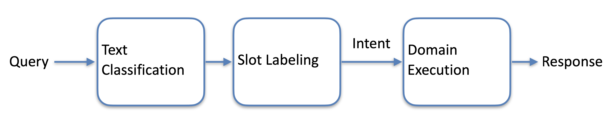

# natural-language-understanding-system
A natural language understanding system can collect user intents and important filtering information from users' natural language, and send the user intent and filtering to supported domain (e.g. weather domain). Then you will get requested information from supported domain, and send requested info back to User

### Architecture 
User intent can be considered like a classification problem. Users may have different intents, and a user's request can be classified as one of it. Based on the attributions of the user intent, the system can get specific filters (e.g. for GetWeather intent, the system will specifically get datetime and location). These filters can be implemented by labeling.
Here is the workflow:

For slot labeling, each domain will have its own label, and it will predict things. 

### Source Data
Data is from https://github.com/sonos/nlu-benchmark, specifically https://github.com/sonos/nlu-benchmark/tree/master/2017-06-custom-intent-engines. Data is in json format. 
A sample data looks like: 
<pre> ```json { "data": [ { "text": "How's the weather in " }, { "text": "Munchique National Natural Park", "entity": "geographic_poi" } ] } ``` </pre>

### Sample Output
If I enter input as "Weather in Sacramento"
Output will be:
2024-10-01 22:23:13,647 prod_cls:GetWeather
2024-10-01 22:23:13,647 It is Weather Query!
2024-10-01 22:23:13,699 Query:Weather -> Label: unspecified
2024-10-01 22:23:13,699 Query:in -> Label: timeRange
2024-10-01 22:23:13,699 Query:Sacramento -> Label:city
2024-10-01 22:23:13,946 Response:City:Sacramento Weather:clear Temperate:74 Humidity:38